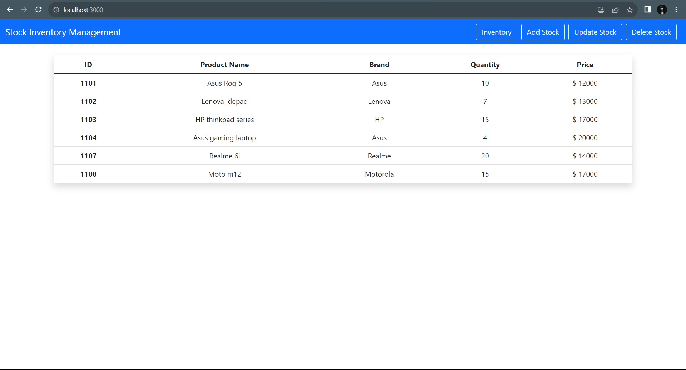
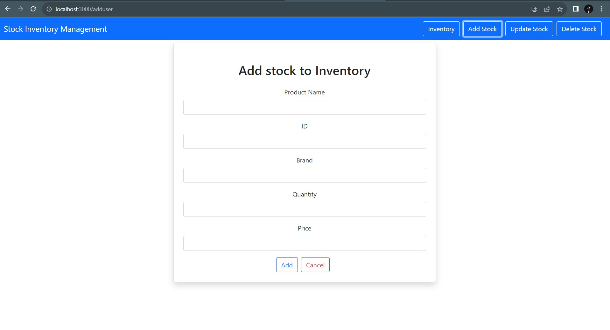
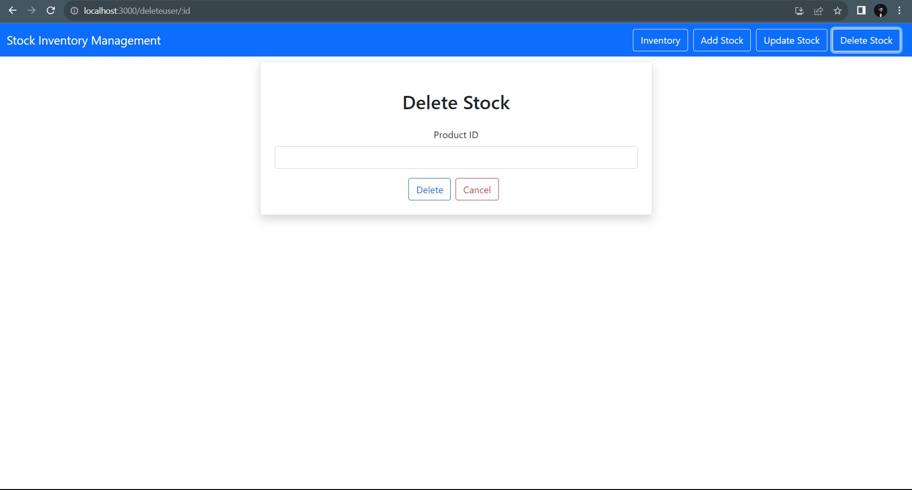

# NM-LICET-GROUP09
<b>Team members :  </b>
1.Meenakshi Sundaram C  - 311120104035 
2.Vaishnavi O - 311120104061 
3.Arivazhagan G -311120104302 

<b>Topic :</b> Stock Inventory Application

<h4>Live Test Link : https://stockim.vercel.app/</h4> 

This application is developed using React JS for Frontend and Spring boot for the Backend. The Inventory details are stored using database and the inventory details are fetched at real time. Also options for Adding a new stock , Updating a stock and deleting the stock are provided. 

<h4>Output Screenshots</h4>

              
